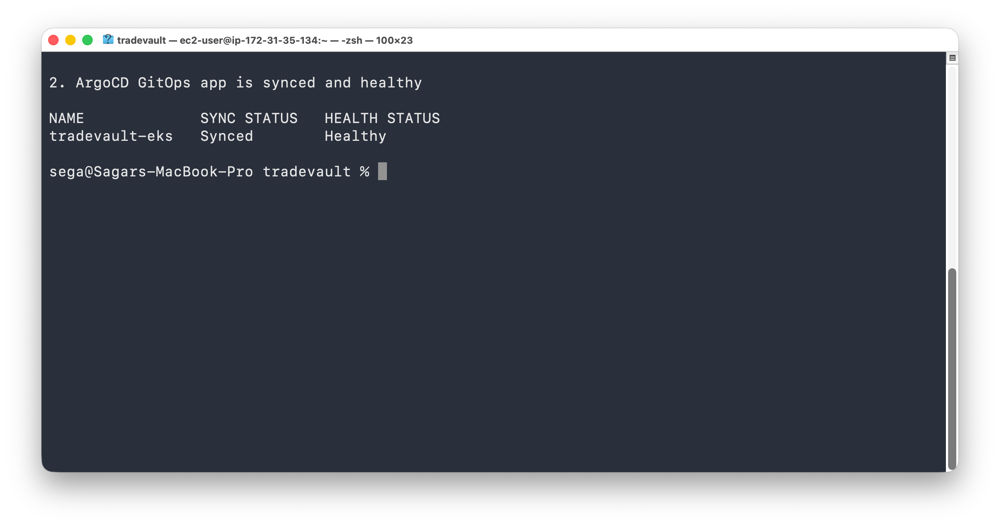
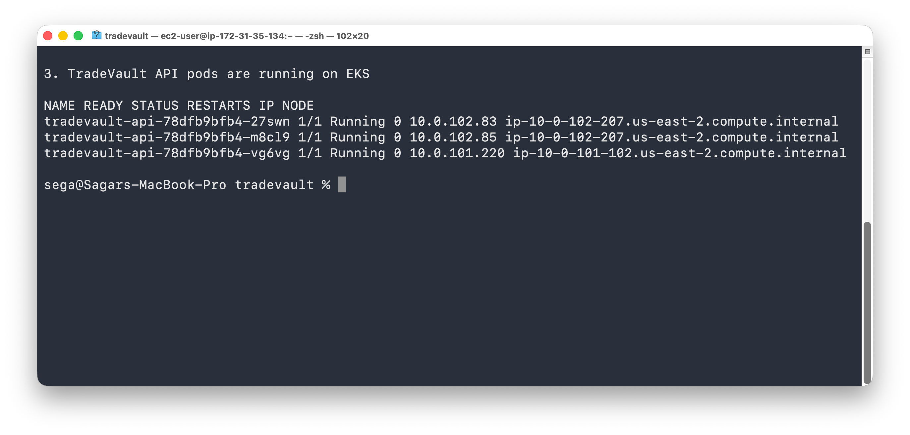
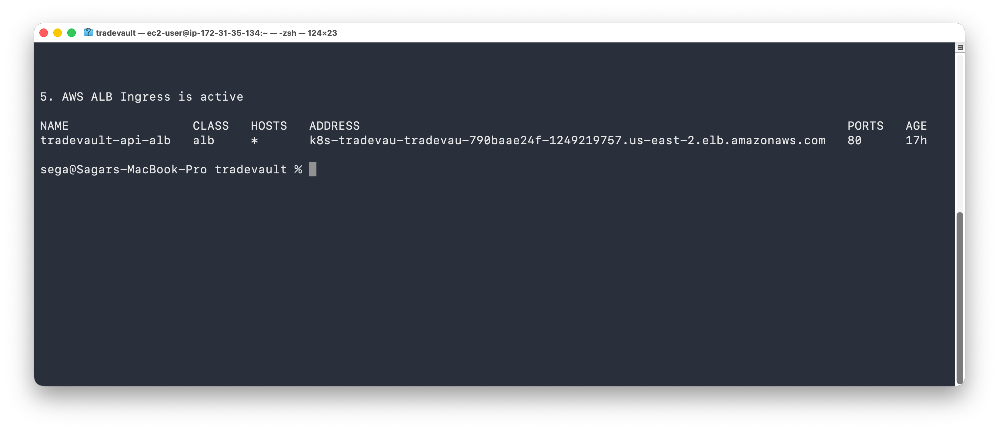
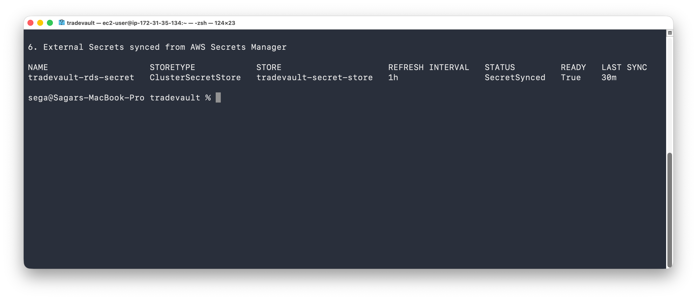
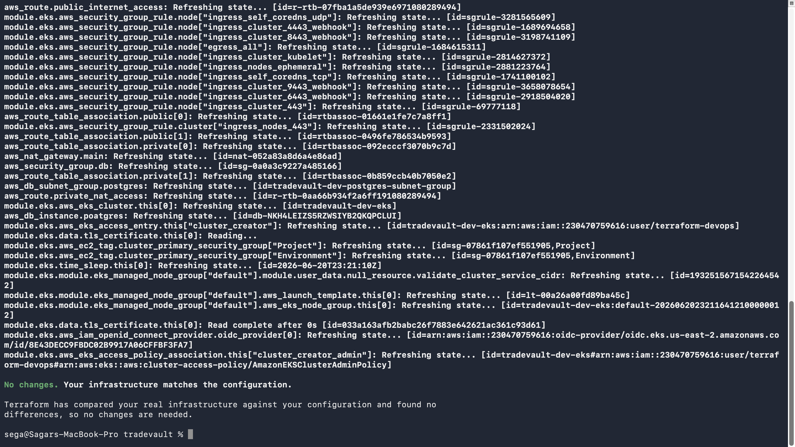
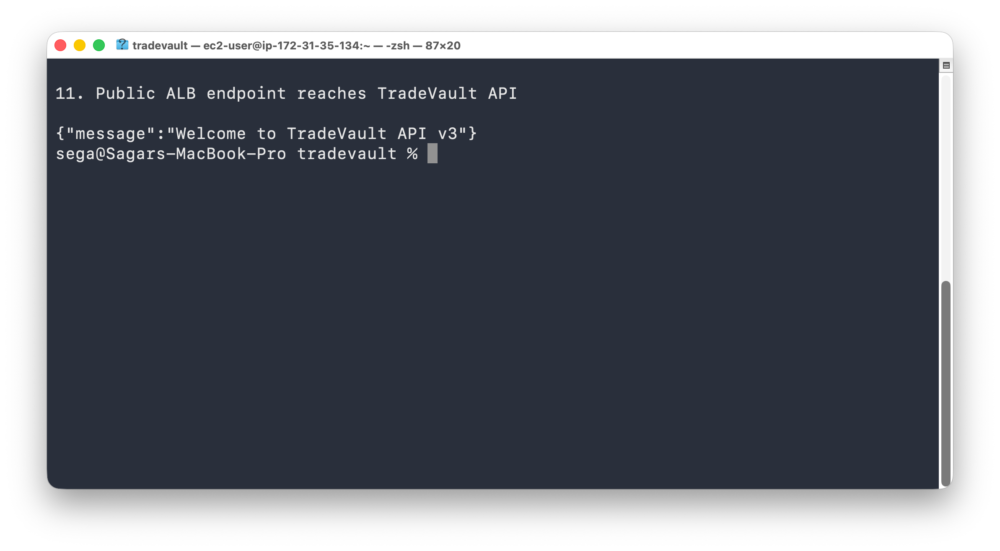
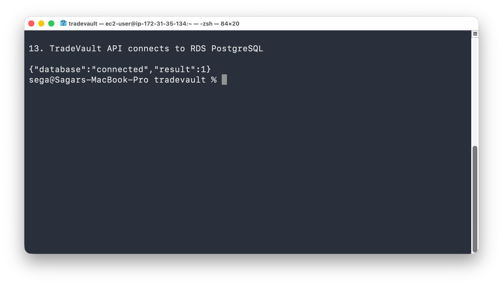
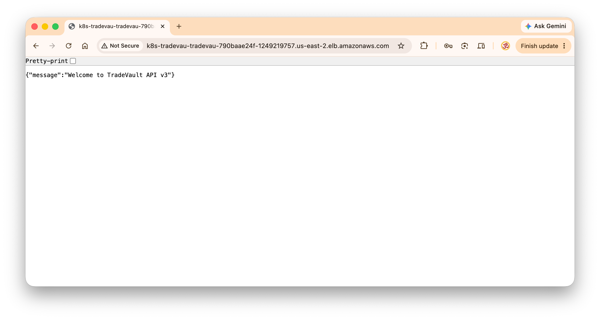

# TradeVault Deployment Proof

This page contains selected screenshots proving that the TradeVault application was successfully deployed to AWS EKS using Terraform, GitHub Actions, ArgoCD, AWS ALB, External Secrets, and RDS PostgreSQL.

---

## 1. ArgoCD Synced and Healthy

---

## 2. TradeVault API Pods Running on EKS

---

## 3. AWS ALB Ingress Active

---

## 4. External Secrets Synced

---

## 5. Terraform Infrastructure Matches AWS

---

## 6. Public API Endpoint Working

---

## 7. RDS Connectivity Proof

---

## 8. Browser API Proof

